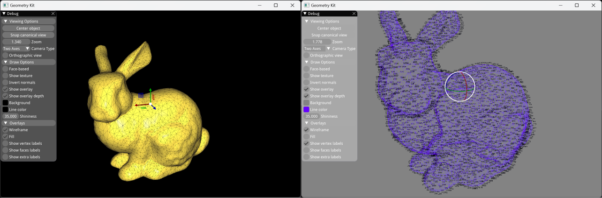

# Geometry Kit

## Build

Use `CMake` to generate this project,you can choose `command line` or `vscode` or `CLion` etc.

After build the project,put the `bunny.off` on the root of the build directory.

## Screenshots

## Feature

- [ ] CMake to xmake
- [ ] Draw plane
- [ ] ...
